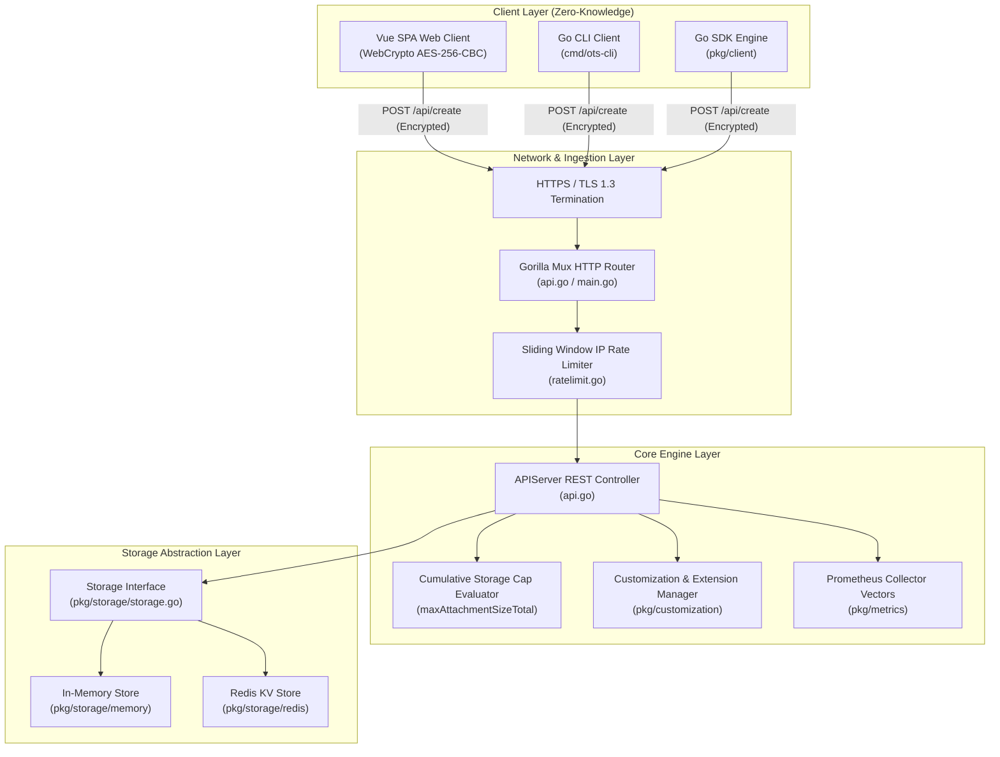
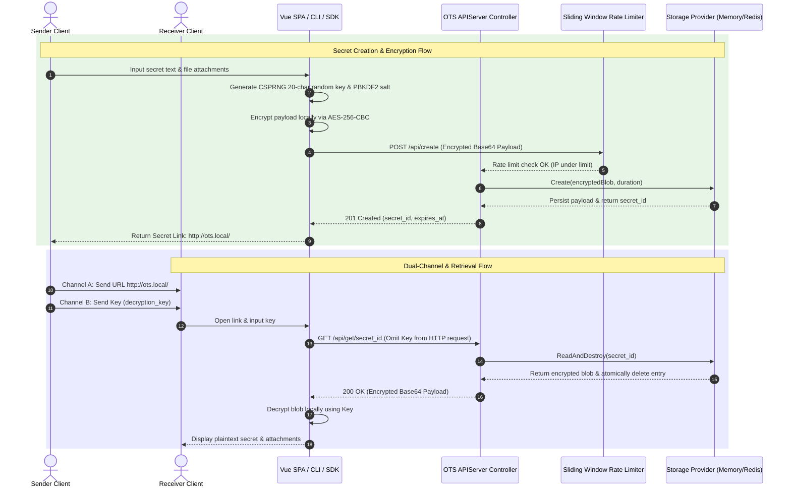
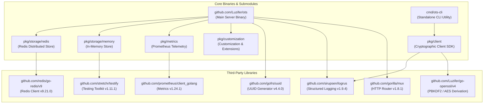
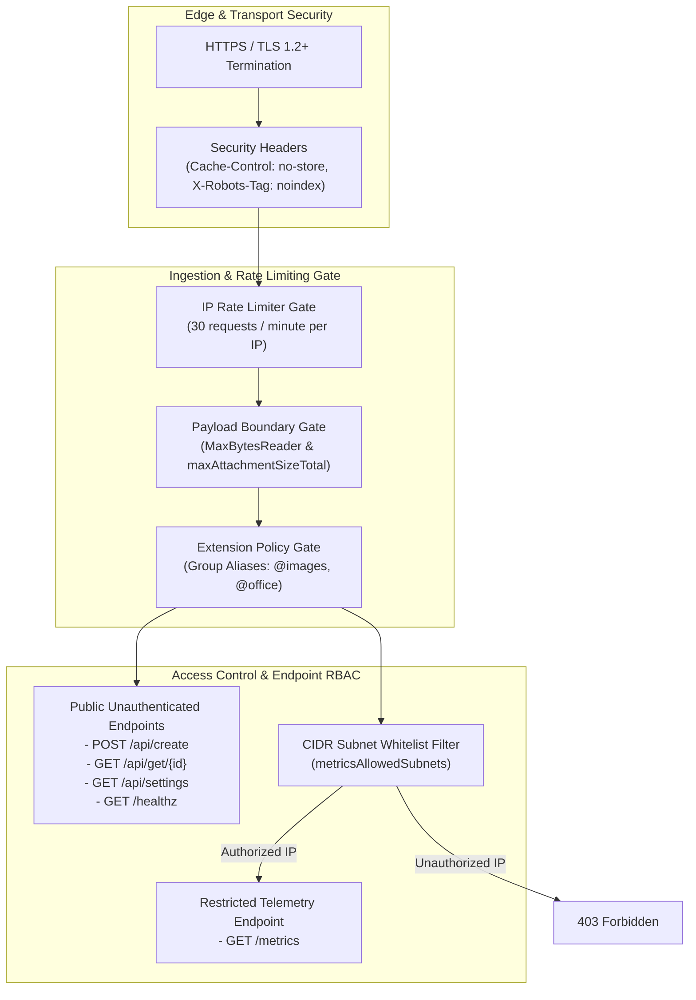

# OTS (One-Time Secrets) Architecture & System Design

This document details the software architecture, design choices, operational data flows, concurrency models, dependency graphs, and security controls of **OTS (One-Time Secrets)**.

---

## 1. Architecture and Design Choices, Assumptions, Edge Cases, Performance & Efficiency

### System Architecture Diagram

### Architectural Design Choices & Assumptions:
- **Zero-Knowledge Encryption:** The server acts purely as an untrusted key-value broker. Plaintext secrets and decryption keys exist exclusively within client RAM and WebCrypto memory spaces.
- **URL Fragment Passphrase Storage:** The encryption passphrase is stored in the URL fragment (`http://...#secret_id|key`). RFC 3986 guarantees that fragments are stripped by HTTP user-agents and never transmitted to the server or reverse proxies.
- **Atomic Read & Destroy:** Storage backends implement non-recoverable delete-on-read semantics (`ReadAndDestroy`). Once fetched, secret blobs are instantly deleted from RAM or Redis key spaces.

### Edge Cases & Defensive Safeguards:
1. **Misconfigured Proxy / Enormous Payload Safeguard:** `http.MaxBytesReader` cuts client connections if payloads exceed `2 * MaxSecretSize` to protect server memory.
2. **Path Traversal & Filename Disambiguation:** Attachment filenames with relative path elements (`../`, `..\`) or dangerous characters are stripped to clean basenames (`filepath.Base`), and filename collisions automatically receive numeric index suffixes.
3. **Storage Exhaustion DoS Mitigation:** In addition to individual payload caps, `maxAttachmentSizeTotal` tracks cumulative active memory bytes atomically to return HTTP 507 Insufficient Storage when total disk/RAM quotas are reached.

---

## 2. Data Flow and Control Logic

### Operational Data Flow Sequence

### Code Relationships & Components:
- **`main.go`**: Parses CLI flags, configures loggers, sets up CORS middleware, embeds static web assets, and launches HTTP server listeners.
- **`api.go` (`APIServer`)**: Orchestrates `/api/create`, `/api/get/{id}`, `/api/settings`, `/healthz`, and `/isWritable`.
- **`ratelimit.go` (`ipRateLimiter`)**: Thread-safe sliding window rate limiter tracking request timestamps per client IP.
- **`pkg/customization` (`Customize`)**: Resolves operator settings, default expiry choices, and expands group extension aliases (`@images`, `@office`, `@archives`, `@packages`, `@binaries`).
- **`pkg/client` (`client.go`)**: Client SDK providing programmatic `Create`, `Fetch`, `FetchWithKey`, and `SplitSecretURL` methods.

---

## 3. Performance and Scalability

### Concurrency Model & Lock Granularity
- **Lock-Free Atomic Counters:** Active storage byte tracking (`storageBytes`) and Prometheus metrics vectors use Go lock-free `sync/atomic` primitives (`atomic.Int64`), eliminating mutex contention during high-throughput secret uploads and downloads.
- **Sliding-Window Mutex Scope:** IP rate limiting (`ipRateLimiter`) uses fine-grained `sync.Mutex` locks held strictly during map timestamp array evaluation, ensuring sub-millisecond lock hold times under heavy concurrent load.
- **Non-Blocking Background Goroutines:** Metrics counter updates (`updateStoredSecretsCount`) and rate limiter ticker cleanups operate asynchronously in detached goroutines to prevent blocking HTTP handler threads.
- **Horizontal Scaling via Redis:** When configured with `--storage-type=redis`, OTS operates completely stateless, allowing horizontal scaling behind load balancers with native Redis key TTL eviction.

---

## 4. Dependencies & System Modules

---

## 5. Security Architecture & RBAC

### Access Control & Security Policies:
1. **Unauthenticated Public Interface:** Secret submission (`POST /api/create`) and secret retrieval (`GET /api/get/{id}`) operate unauthenticated to ensure zero-friction encrypted secret exchanges.
2. **Telemetry Whitelist RBAC (`metricsAllowedSubnets`):** Access to Prometheus metrics (`GET /metrics`) is enforced via CIDR subnet matching (e.g. `["127.0.0.1/32", "10.0.0.0/8"]`). Unauthorized IPs receive HTTP 403 Forbidden.
3. **Zero Traceability:** Error responses generate a random tracking UUID (`err_id`) logged internally while returning clean JSON error responses to callers, preventing internal stack trace disclosure.

---

## 6. System References
- **[PRODUCT.md](PRODUCT.md)** - Operational Guide, Security Assessment & Deployment Options
- **[TESTING.md](TESTING.md)** - Complete Test Suite Specifications, E2E Specifications, and Code Coverage Report
