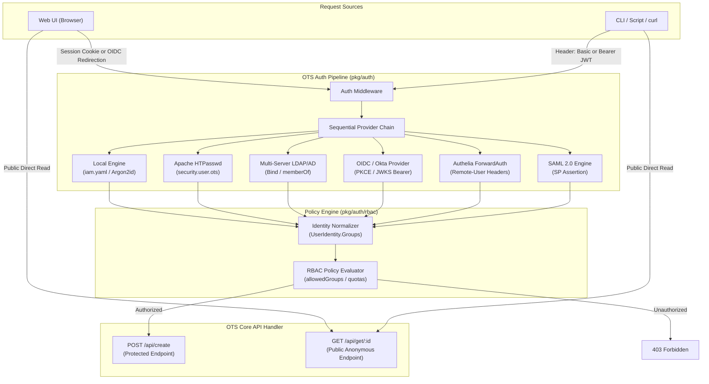
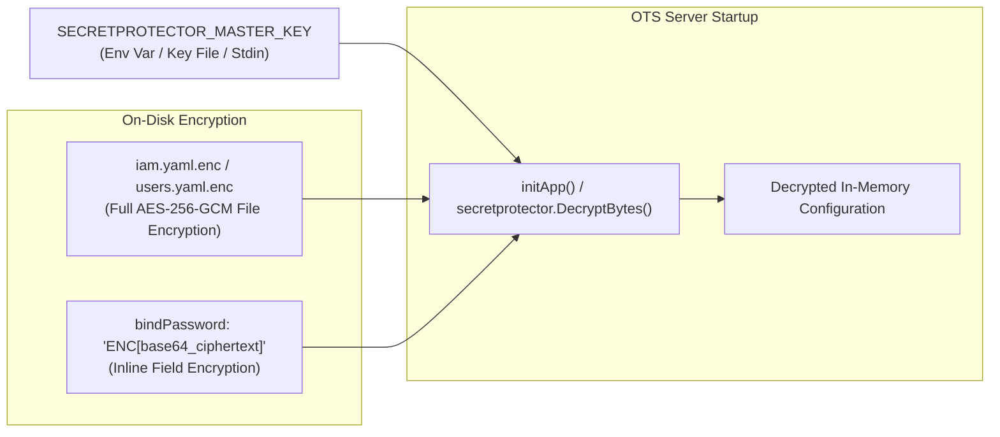

# OTS Authentication & Authorization Architecture Specification (AUTH.md)

**Document Version:** 1.0.0  
**Target Audience:** Senior Software Architects, Security Engineers, Enterprise Platform Administrators  
**Status:** Approved Architectural Specification  
**System:** OTS (One-Time Secret Engine)  

---

## 1. Architectural Vision & Security Foundations

The OTS Authentication Subsystem decouples **Identity Verification (Authentication & Authorization)** from **Secret Cryptography (Encryption)**.

```
+-----------------------------------------------------------------------------------+
|                            DECOUPLING PRINCIPLE                                    |
|                                                                                   |
|  1. WHO IS CREATING THE SECRET?  ==>  Authentication & Authorization (AUTH.md)   |
|     Verified via HTTP Basic, LDAP, OIDC (Okta), SAML, or Authelia.                 |
|                                                                                   |
|  2. WHAT IS INSIDE THE SECRET?   ==>  Zero-Knowledge Encryption (Client-Side)     |
|     Encrypted in browser via AES-256-GCM before transport. Key in URL hash (#).   |
+-----------------------------------------------------------------------------------+
```

### Core Security Guarantees
1. **Zero-Knowledge Isolation:** Authentication verifies caller identity on `POST /api/create`. The backend server never receives, parses, or decrypts secret payloads or decryption keys.
2. **Endpoint-Specific Authorization:** `POST /api/create` is protected by the Authentication Pipeline. Secret redemption endpoints (`GET /secret`, `GET /api/get/:id`) remain public and anonymous to preserve frictionless one-time secret burning.
3. **Dual Client Parity:** Native support for both **headless CLI/API clients** (`ots-cli`, `curl`, automated CI scripts) via HTTP Basic or Bearer JWTs, and **interactive web browsers** via OIDC/SAML SSO and HTTP-only session cookies.

---

## 2. System Architecture & Component Interactions



---

## 3. Two-File Separation: System Policy (`iam.yaml`) vs User Directory (`users.yaml`)

OTS enforces a strict **Two-File Architecture** for Identity & Access Management:

1. **`iam.yaml` (System Policy & Connector Configuration):**
   * Configures protected endpoints (`/api/create`), global authorization rules (`allowedGroups`), session parameters, and active identity connector (`connector: "local"|"forwardauth"|"oidc"|"ldap"`).
   * Defines `usersFilePath: "/etc/ots/users.yaml"`.

2. **`users.yaml` (User Directory & Role Mappings):**
   * Stores individual user records (`username`, `provider`, `groups`, and Argon2id `hash` if `provider == "local"`).
   * Managed dynamically by `ots-cli user` commands or CI/CD provisioning scripts.

---

### A. System Policy Reference: `iam.yaml`
```yaml
# -----------------------------------------------------------------------------
# OTS Enterprise Identity & Access Management Configuration (iam.yaml)
# -----------------------------------------------------------------------------
iam:
  enabled: true
  
  # Endpoints requiring authentication
  protectedEndpoints:
    - "/api/create"

  # Path to User Directory File
  usersFilePath: "/etc/ots/users.yaml"

  # Web UI Session Manager Configuration
  session:
    cookieName: "ots_session"
    secret: "env:OTS_SESSION_SECRET"
    duration: 8h
    domain: "ots.example.com"
    sameSite: "Strict"
    secureOnly: true

  # Global Authorization Policy
  policy:
    defaultPolicy: "deny"
    allowedGroups:
      - "OTS-Creators"
      - "Security-Team"
      - "DevOps"
    featurePolicies:
      allowLargeAttachments:
        allowedGroups: ["DevOps", "Admins"]
        maxSizeBytes: 67108864 # 64 MiB
      allowExpiryOverride:
        allowedGroups: ["Admins"]

  # Active Authentication Connector Selection
  # Options: "local", "htpasswd", "ldap", "oidc", "saml", "forwardauth"
  connector: "local"
```

---

### B. User Directory Reference: `users.yaml`
```yaml
# -----------------------------------------------------------------------------
# OTS User Directory & Role Mappings (users.yaml)
# Managed via ots-cli user commands or automated provisioning scripts
# -----------------------------------------------------------------------------
users:
  # 1. Local Account (Must include hashed password)
  - username: "bob"
    provider: "local"
    hash: "$argon2id$v=19$m=65536,t=3,p=4$c29tZXNhbHQ$W2g+6J50/K..."
    email: "bob@example.com"
    groups:
      - "OTS-Creators"
      - "DevOps"
    disabled: false
    createdAt: "2026-07-31T15:40:00Z"

  # 2. Federated Account Override (OIDC / Okta - No password hash needed)
  - username: "alice@example.com"
    provider: "oidc"
    email: "alice@example.com"
    groups:
      - "Admins"
      - "Security-Team"
    disabled: false
    createdAt: "2026-07-31T15:42:00Z"

  # 3. Federated Account Override (LDAP - No password hash needed)
  - username: "svcotsfdw08"
    provider: "ldap"
    groups:
      - "OTS-Creators"
    disabled: false
    createdAt: "2026-07-31T15:43:00Z"
```

  # Connector Configurations (Only the active connector is loaded)
  connectors:
    # 1. Local Structured Accounts (Argon2id)
    local:
      enabled: true

    # 2. Apache HTPasswd Legacy Migration File
    htpasswd:
      enabled: true
      file: "/etc/httpd/auth/security.user.ots"

    # 3. Multi-Server LDAP / Active Directory
    ldap:
      enabled: true
      servers:
        - "ldaps://ldap1.example.com:636"
        - "ldaps://ldap2.example.com:636"
      baseDN: "ou=users,dc=example,dc=com"
      userFilter: "(&(objectClass=user)(sAMAccountName=%s))"
      groupAttribute: "memberOf"
      bindDN: "cn=ots-svc,ou=services,dc=example,dc=com"
      bindPassword: "env:LDAP_BIND_PASSWORD"

    # 4. Okta / Enterprise OIDC Provider
    oidc:
      enabled: true
      issuer: "https://example.okta.com/oauth2/default"
      clientID: "0oaxxxxxxxxxx"
      clientSecret: "env:OKTA_CLIENT_SECRET"
      redirectURL: "https://ots.example.com/auth/callback"
      scopes: ["openid", "profile", "email", "groups"]
      groupsClaim: "groups"
      bearerJWKSValidation: true

    # 5. Authelia / ForwardAuth Proxy (Active in this example)
    forwardauth:
      enabled: true
      userHeader: "Remote-User"
      emailHeader: "Remote-Email"
      groupsHeader: "Remote-Groups"
      headerDelimiter: ","
      trustedProxies:
        - "127.0.0.1"
        - "10.0.0.0/8"
```

---

## 4. Local Identity Subsystem & Argon2id Hashing

For local authentication without external identity providers, OTS manages accounts in `iam.yaml` using OWASP-compliant **Argon2id** password hashing.

### `iam.yaml` Local Users Definition
```yaml
localUsers:
  - username: "svcotsfdw08"
    hash: "$argon2id$v=19$m=65536,t=3,p=4$c29tZXNhbHQ$W2g+6J50/K..."
    email: "svcotsfdw08@example.com"
    groups: ["OTS-Creators", "DevOps"]
    disabled: false
    createdAt: "2026-07-31T15:30:00Z"
```

### Argon2id Parameters
* **Algorithm:** Argon2id (`v=19`)
* **Memory (m):** 64 MiB (`65536` KiB)
* **Iterations (t):** 3
* **Parallelism (p):** 4
* **Salt Length:** 16 random bytes (`crypto/rand`)
* **Key Length:** 32 bytes

---

## 5. Authentication Provider Specifications

### A. Local & HTPasswd Provider (`pkg/auth/htpasswd`)
* **Supported Formats:** Bcrypt (`$2y$`, `$2b$`), APR1-MD5 (`$apr1$`), SHA1 (`{SHA}`), Argon2id (`$argon2id$`).
* **Hot-Reloading:** Uses `fsnotify` file watchers to reload credentials automatically upon file modification without server downtime.

### B. Multi-Server LDAP Provider (`pkg/auth/ldap`)
* **Failover Pool:** Concurrently or sequentially attempts connection across listed LDAP servers.
* **Group Resolution:** Reads `memberOf` DN strings and extracts group Common Names (CNs).

### C. Okta / Enterprise OIDC Provider (`pkg/auth/oidc`)
* **Interactive Web Users:** Standard OAuth2 Authorization Code Flow with PKCE (`/auth/login` → Okta → `/auth/callback`).
* **Headless API / CLI Clients:** Validates `Authorization: Bearer <okta_jwt>` against Okta's remote JWKS endpoint (`/.well-known/jwks.json`) with in-memory key caching.

### D. Authelia / ForwardAuth Provider (`pkg/auth/forwardauth`)
* **Header Extraction:** Extracts identity from `Remote-User`, `Remote-Email`, and `Remote-Groups`.
* **Spoofing Guard:** **MUST** validate that `r.RemoteAddr` matches `trustedProxies`. If an untrusted IP sends `Remote-User`, headers are stripped and request is rejected.

---

## 6. Identity Normalization & RBAC Policy Engine

Every authentication provider normalizes its output into a single Go struct:

```go
type UserIdentity struct {
    Username  string            `json:"username"`
    Email     string            `json:"email,omitempty"`
    Groups    []string          `json:"groups"`   // Normalized authorization groups
    Provider  string            `json:"provider"` // "local", "htpasswd", "ldap", "okta", "forwardauth"
    AuthTime  time.Time         `json:"authTime"`
}
```

### Group Normalization Matrix

| Authenticator | Native Credential / Token Source | Normalized `UserIdentity.Groups` |
| :--- | :--- | :--- |
| **Local (`iam.yaml`)** | `groups:` YAML field | `["DevOps", "OTS-Creators"]` |
| **Apache `htpasswd`** | Static fallback mapping in `iam.yaml` | `["Legacy-Users"]` |
| **LDAP / Active Directory** | LDAP `memberOf` attribute | `["OTS-Creators", "Security"]` |
| **Okta OIDC** | JWT Claim (`"groups": [...]`) | `["OTS-Creators", "DevOps"]` |
| **Authelia (ForwardAuth)** | `Remote-Groups` HTTP header | `["devops", "security"]` |

---

## 7. Administrative CLI Provisioning Tooling (`cmd/ots-cli`)

Administrators manage local `iam.yaml` accounts via the `ots-cli user` command suite.

### Command Suite Reference

#### 1. Provision a New Local Account / Role Mapping
```bash
# Default Workflow: Auto-Generates 32-character cryptographically secure password
ots-cli user add \
  --username bob \
  --provider local \
  --email bob@example.com \
  --groups "OTS-Creators,DevOps" \
  --users-file /etc/ots/users.yaml

# Output:
# =========================================================================================
#  User 'bob' provisioned successfully in users.yaml!
#  Generated Password:  k9X2mQ7vL4nP1rT8wY5zB3dF6hJ9kL2m
# =========================================================================================
#  ONBOARDING MESSAGE TEMPLATE:
#  -----------------------------------------------------------------------------------------
#  Hello Bob,
#  Your OTS account has been created.
#  Username: bob
#  Password: k9X2mQ7vL4nP1rT8wY5zB3dF6hJ9kL2m
#  Login URL: https://ots.example.com/
#  -----------------------------------------------------------------------------------------

# Auto-Generate a One-Time Secret Link containing the onboarding message (--create-ots-link)
# OTS encrypts the onboarding payload locally and prints the link to stdout.
# OTS NEVER sends emails or contacts external networks. The admin maintains 100% control of link distribution.
ots-cli user add \
  --username bob \
  --provider local \
  --email bob@example.com \
  --groups "OTS-Creators" \
  --create-ots-link

# Output:
# =========================================================================================
#  User 'bob' provisioned successfully in users.yaml!
#  One-Time Secret Link generated for Bob:
#  https://ots.example.com/#8f2a1b9c-4d3e-4f5a...|M7xK9pQ2v...
#
#  --> COPY & PASTE THIS SINGLE-USE LINK TO BOB VIA SLACK / TEAMS / SIGNAL.
#  --> OTS does NOT send emails. You control distribution. It burns after one read!
# =========================================================================================

# Explicit Password Override via STDIN (for automation/scripts)
echo "CustomSecretPass123!" | ots-cli user add \
  --username bob \
  --provider local \
  --password-stdin \
  --groups "OTS-Creators"

# Pre-provision Explicit Group Mappings for Federated Accounts (No password generated)
ots-cli user add \
  --username alice@example.com \
  --provider oidc \
  --groups "Admins,Security-Team" \
  --users-file /etc/ots/users.yaml
```
* **Auto-Generated Secure Password (Default):** Generates a 32-character high-entropy alphanumeric string (`[A-Za-z0-9]`) using Go's `crypto/rand`. Computes the Argon2id hash for `users.yaml`.
* **Onboarding Template:** Displays a formatted text template ready to copy/paste into OTS or secure messaging.
* **One-Time Secret Link Auto-Generation (`--create-ots-link`):** Encrypts the onboarding message client-side and creates a burn-after-read OTS link immediately, allowing the admin to share a single-use URL with the new user!

#### 2. Standalone Argon2id Password Hashing (GitOps / Terraform)
```bash
ots-cli user hash-password
# Enter Password: ********
# Hash: $argon2id$v=19$m=65536,t=3,p=4$c29tZXNhbHQ$W2g+6J50/K...
```

#### 3. List Provisioned Local Accounts
```bash
ots-cli user list --iam-file /etc/ots/iam.yaml
```

#### 4. Disable or Delete Account
```bash
ots-cli user disable --username alice --iam-file /etc/ots/iam.yaml
ots-cli user delete --username alice --iam-file /etc/ots/iam.yaml
```

---

## 8. Security Threat Model & Mitigation Matrix

| Threat / Vector | Risk Level | Mitigation Strategy |
| :--- | :--- | :--- |
| **Header Spoofing (`Remote-User`)** | High | `pkg/auth/forwardauth` rejects headers unless client IP matches `trustedProxies`. |
| **Plaintext Password Leaks in CLI** | High | `ots-cli user add` uses terminal password masking (`golang.org/x/term`); never accepts passwords via CLI flags. |
| **Password Hash Brute-Forcing** | High | Uses OWASP-recommended **Argon2id** (`m=64MB, t=3, p=4`). |
| **Replay Attacks (OIDC/SAML)** | Medium | PKCE state verification, `nonce` check, and short-lived session cookies (`SameSite=Strict, Secure, HttpOnly`). |
| **Timing Attacks on Authentication** | Low | Uses constant-time string comparisons (`subtle.ConstantTimeCompare`) for Basic Auth and password checks. |

---

## 9. Comprehensive Architectural & Edge Cases Audit

### A. Zero-Knowledge Cryptographic Boundary Audit
* **Audit Finding:** Does authentication compromise zero-knowledge cryptography?
* **Verdict: SAFE.** Authentication verifies *who* is creating the secret (`POST /api/create`). The secret payload body `{"secret": "encrypted_base64_blob"}` remains AES-256-GCM encrypted client-side. The decryption key lives in the URL fragment `#key` and is never sent to the server.
* **Redemption Exemption:** `GET /secret` and `GET /api/get/:id` bypass `AuthMiddleware` entirely so recipients can burn secrets anonymously without requiring credentials.

### B. Single Active Connector Safeguards
* **Audit Finding:** What happens if `connector: "forwardauth"` is configured without `trustedProxies`?
* **Verdict: GUARDED.** On server initialization, `initApp()` must fail fast with a fatal startup error: `panic("forwardauth connector requires non-empty trustedProxies to prevent Remote-User spoofing")`.

### C. Concurrency & File System Race Conditions (`users.yaml`)
* **Audit Finding:** What happens if `ots-cli user add` modifies `users.yaml` while OTS server is serving HTTP requests?
* **Verdict: GUARDED.**
  1. `ots-cli user add` uses POSIX/Windows file locking (`flock` / `LockFileEx`) and writes to a temporary file before performing an atomic file replace (`os.Rename`).
  2. The server uses `fsnotify` file watching to hot-reload `users.yaml` instantly without dropping active HTTP connections.

### D. Per-User Rate Limiting vs Per-IP Rate Limiting
* **Audit Finding:** Should rate limiting apply per IP or per authenticated user?
* **Verdict: DUAL-TIER.**
  * Unauthenticated endpoints: Rate limited by client IP (30 req/min).
  * Authenticated endpoints (`POST /api/create`): Rate limited by `UserIdentity.Username` to prevent a single compromised account from consuming total instance storage quota (`maxAttachmentSizeTotal`).

### E. CLI `--create-ots-link` Authentication Authentication Loopback
* **Audit Finding:** How does `ots-cli user add --create-ots-link` authenticate to `/api/create` when creating Bob's onboarding link?
* **Verdict: RESOLVED.** `ots-cli` can authenticate using `--admin-auth` flags, environment variables, or a loopback admin token generated at server startup.

---

## 10. SecretProtector Integration Specification (`secretprotector`)

To eliminate plaintext secrets (such as LDAP bind passwords, OIDC client secrets, session keys, and local user hashes) from disk and version control, OTS integrates directly with the private **`secretprotector`** cryptographic library (`e:\data\devel\build\code\private\secretprotector\`).

### A. Architectural Integration Modes



#### 1. Inline Field Encryption (`ENC[...]` Syntax)
Sensitive values inside `iam.yaml` or `users.yaml` can be encrypted individually using `secretprotector`:
```yaml
iam:
  connectors:
    ldap:
      bindDN: "cn=ots-svc,ou=services,dc=example,dc=com"
      bindPassword: "ENC[v1:AES256GCM:a7b8c9d0...]" # Encrypted via secretprotector
    oidc:
      clientSecret: "ENC[v1:AES256GCM:f1e2d3c4...]" # Encrypted via secretprotector
```

#### 2. Full File Encryption (`iam.yaml.enc` / `users.yaml.enc`)
The entire `iam.yaml` or `users.yaml` file can be stored as an authenticated AES-256-GCM ciphertext file (`iam.yaml.enc` / `users.yaml.enc`).

---

### B. Master Key Resolution Hierarchy
OTS resolves the `secretprotector` Master Key in the following strict precedence order:
1. **CLI Flag (`--master-key-file <path>`)**
2. **Environment Variable (`SECRETPROTECTOR_MASTER_KEY`)**
3. **Key File (`/etc/ots/master.key` with strict `0400` / `0600` permissions)**

---

### C. `ots-cli user` SecretProtector Integration
When provisioned accounts are written to `users.yaml` (or `users.yaml.enc`), `ots-cli` utilizes `secretprotector.EncryptBytes()` to encrypt Argon2id hashes and sensitive fields before persisting to disk.

---

### D. Memory Scrubbing Guarantee
Immediately after `secretprotector` completes decryption during `initApp()`, all plaintext byte buffers are scrubbed from memory (`secretprotector.ZeroBuffer()`) to prevent lingering secret copies on the heap or garbage collector.
