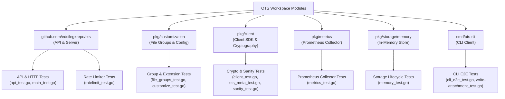
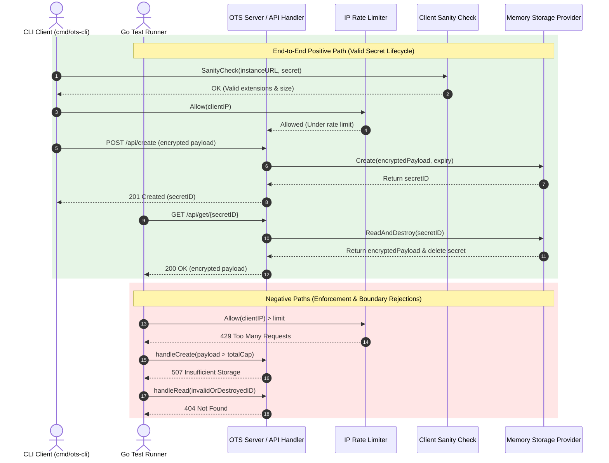

# OTS (One-Time Secrets) Test Suite Documentation

This document provides a comprehensive guide to the architecture, design, test cases, execution procedures, and code coverage metrics for the **OTS (One-Time Secrets)** repository.

---

## 1. Architecture, Design & Principles

The OTS test suite is designed around three core principles:
1. **Zero-Flake Isolation:** Unit tests run in-memory without external infrastructure or database dependencies.
2. **End-to-End Cryptographic Integrity:** Tests verify that secrets are encrypted on the client side, stored purely as encrypted blobs, and decrypted locally upon retrieval.
3. **OS & Environment Independence:** Extension matching and rate-limiting tests execute deterministically across Windows, Linux, and macOS.



---

## 2. Logic Flow & Test Sequence

The test suite validates both **positive execution paths** (happy path) and **negative execution paths** (validation errors, rate limits, payload size caps, expired secrets).



---

## 3. Technical Requirements and Setup

### Dependencies
- **Go**: Version `1.21` or higher.
- **Testing Libraries**: `github.com/stretchr/testify` (`assert`, `require`).
- **HTTP Routing & Multiplexing**: `github.com/gorilla/mux`.
- **Metrics**: `github.com/prometheus/client_golang`.
- **CLI Framework**: `github.com/spf13/cobra`.

### Environment Variables
- `GITHUB_TOKEN`: *(Optional)* Set to empty string in PowerShell (`$env:GITHUB_TOKEN=""`) when running `gh` CLI commands locally.

### Workspace Constraints
- OTS consists of decoupled Go submodules (`pkg/customization`, `pkg/client`, `cmd/ots-cli`).
- Submodule tests must be executed within their respective module directories or via workspace recursion (`go test ./...`).

---

## 4. Test Inventory & Specification Table

| Logical Group | Test Name | Technical Purpose / Description | Success Criteria (Expected Result) |
|---|---|---|---|
| **Auth Pipeline** | `TestAuthForwardAuthHeaders` | Tests ForwardAuth reverse proxy header trust, IP verification, and identity extraction. | **PASS**: Trusted proxy headers return identity; untrusted header spoofing rejected. |
| **Auth Pipeline** | `TestAuthLocalArgon2id` | Tests Argon2id password verification, atomic file saving, user deletion, base64 fallback, and hot-reloading. | **PASS**: Argon2id verification succeeds; `DeleteUser` removes entry atomically. |
| **Auth Pipeline** | `TestAuthRBACEvaluator` | Tests group RBAC authorization and path normalization (`path.Clean()`) against `/api/create`. | **PASS**: Authorized groups pass; unauthorized or path-traversal attempts return 403 Forbidden. |
| **CLI User Suite**| `TestCLIUserAddListDisableDelete` | Full E2E CLI testing of `ots-cli user add`, `list`, `disable`, and `delete` commands against `users.yaml`. | **PASS**: User account created, listed, disabled, and deleted cleanly. |
| **Live E2E** | `TestLiveServerLargeAttachmentsE2E` | Verifies end-to-end 10MB binary attachment payload creation, HTTP transfer, and byte-for-byte decryption against live local OTS server. | **PASS**: 10MB attachment uploaded, fetched, and verified 100% intact. |
| **Live E2E** | `TestLiveServerExtensionFilteringE2E` | Tests live extension filtering using group aliases (`@images`, `@office`) and blocked extensions (`.exe`). | **PASS**: Allowed extensions pass pre-flight; blocked extensions return `false`. |
| **Live E2E** | `TestLiveServerDualChannelSplitKeyE2E` | Tests Issue #208 dual-channel delivery: splits URL into base URL `#secret_id` and key, decrypting via `FetchWithKey`. | **PASS**: Base URL without key fails; `FetchWithKey(baseURL, key)` decrypts and burns secret. |
| **Live E2E** | `TestLiveServerConcurrencyAndAntiSpoofingE2E` | Spawns 20 parallel worker goroutines creating and fetching secrets simultaneously against live HTTP server. | **PASS**: All 20 parallel workers create and fetch secrets with 0 race conditions or deadlocks. |
| **Live E2E** | `TestLiveServerSanitizedErrorResponsesE2E` | Verifies non-existent IDs and malformed JSON payloads return sanitized UUID error tracking IDs without stack leaks. | **PASS**: 404 and 400 responses return clean sanitized UUID error IDs. |
| **Live Redis E2E**| `TestLiveRedisStorageValidation` | Validates live secret creation, atomic burn-after-read, and expiration against an orchestrated Redis server on port `63799` via `ots_builder.sh --validate --with-redis [<path>]`. | **PASS**: Secret stored in Redis hash key, retrieved, burned atomically, and verified deleted from Redis. |
| **Redis Store** | `TestRedisStorageNewValidation` | Tests `REDIS_URL` connection URL validation and custom key namespace prefix formatting (`REDIS_KEY`). | **PASS**: Missing or invalid `REDIS_URL` returns explicit error; `redisKey()` formats correctly. |
| **Listener Guard**| `TestListenerHardening` | Tests automatic hardening of default `:3000` to `127.0.0.1:3000` when TLS is disabled, while respecting custom `--listen`. | **PASS**: Default `:3000` hardens to `127.0.0.1:3000`; custom `--listen` is honored. |
| **CLI E2E** | `TestCLICreateAndFetchE2E` | Full E2E CLI client secret creation and retrieval against live test HTTP server. | **PASS**: Secret created, URL formatted, fetched secret matches input, second fetch returns 404. |
| **CLI E2E** | `TestCLICreateNoteViaPositionalArgumentAndNoteFlag` | Tests CLI secret note creation via positional argument (`ots-cli create "note"`) and `-n/--note` flag. | **PASS**: Note content extracted cleanly from positional argument and flag. |
| **CLI E2E** | `TestCLINewCommands` | Tests `ots-cli genpass` CSPRNG password generation and `ots-cli info` server settings retrieval. | **PASS**: 32-character password generated; server settings and allowed extensions parsed. |
| **CLI E2E** | `TestCLIBurnAndInfoE2EAgainstLiveServer` | Tests `ots-cli burn` instant secret destruction and `ots-cli info` capability inspection against live HTTP server. | **PASS**: Secret burned immediately on fetch; second retrieval returns 404. |
| **CLI E2E** | `TestCLIAttachmentCreationE2E` | Tests CLI attachment serialization with file content payload. | **PASS**: Attachment content, file name, and MIME type preserved. |
| **CLI Attachments**| `TestStoreAttachmentCollision` | Tests attachment filename deduplication when writing attachments to disk. | **PASS**: Conflicting filenames disambiguated safely without overwriting. |
| **CLI Attachments**| `TestStoreAttachmentRejectsInvalidNames` | Validates rejection of dangerous path traversal characters in attachment names (`/`, `\`, `.`). | **PASS**: Invalid filenames rejected with explicit error. |
| **CLI Attachments**| `TestStoreAttachmentStripsPathComponents` | Verifies path component sanitization for relative/absolute attachment paths. | **PASS**: Path prefixes stripped to leave clean basename. |
| **API & Routing** | `TestHandleCreateExpiryOverrideAcceptedValues` | Verifies handling of custom secret expiry override values (0, 1s, positive durations). | **PASS**: Status 201 Created with valid `expires_at` timestamp. |
| **API & Routing** | `TestHandleCreateExpiryOverrideValidation` | Validates rejection of negative or malformed `expire` query parameters. | **PASS**: Status 400 Bad Request. |
| **API & Routing** | `TestHandleSettings` | Tests GET `/api/settings` endpoint JSON response and `resolvedAcceptedExtensions`. | **PASS**: Status 200 OK with `resolvedAcceptedExtensions` array. |
| **API & Routing** | `TestHandleReadAndDestroy` | Verifies one-time secret consumption: initial fetch succeeds, second fetch fails. | **PASS**: 1st fetch returns 200 OK; 2nd fetch returns 404 Not Found. |
| **API & Routing** | `TestAPIRegister` | Validates Gorilla Mux route registration for `/healthz`, `/isWritable`, `/create`, `/get/{id}`. | **PASS**: All endpoints respond with correct status codes (200, 204). |
| **Rate Limiting** | `TestIPRateLimiter` | Tests unit logic of thread-safe sliding window IP rate limiter. | **PASS**: Requests beyond configured limit return `false` on `Allow()`. |
| **Rate Limiting** | `TestIPRateLimiterSharding` | Exercises 32 sharded mutex buckets and FNV-1a integer hashing under concurrent multi-IP traffic. | **PASS**: Requests hashed into separate shards without mutex contention. |
| **Rate Limiting** | `TestGetClientIP` | Tests IP extraction from `X-Forwarded-For` and `X-Real-IP` proxy headers. | **PASS**: First proxy IP correctly parsed. |
| **Rate Limiting** | `TestGetClientIPTrustedProxies` | Tests anti-spoofing header extraction: honors headers from trusted CIDRs, rejects headers from untrusted IPs. | **PASS**: Trusted proxy CIDRs honored; untrusted header spoofing rejected. |
| **Rate Limiting** | `TestRateLimiterIntegration` | Simulates repeated POST requests to `/api/create` from the same client IP. | **PASS**: Initial requests 201 Created; subsequent request returns 429. |
| **Storage Cap** | `TestCumulativeStorageCapIntegration` | Simulates cumulative secret uploads exceeding `MaxAttachmentSizeTotal`. | **PASS**: Excess upload returns 507 Insufficient Storage. |
| **High Capacity** | `TestLargeSecretAndAttachmentSupport` | Tests high-capacity secret payload creation (256MB limit, 5MB payload). | **PASS**: Status 201 Created; payloads over threshold return 400. |
| **Privacy / SEO** | `TestHandleRobotsDisabled` | Tests `/robots.txt` output and `X-Robots-Tag` headers when search indexing is disabled. | **PASS**: Status 200 OK; `Disallow: /` and `X-Robots-Tag: noindex`. |
| **Privacy / SEO** | `TestHandleRobotsEnabled` | Tests `/robots.txt` output when search indexing is allowed. | **PASS**: Status 200 OK; `Allow: /` without noindex header. |
| **Assets & Server**| `TestAssetDelivery` | Tests static asset delivery and 404 handling for non-existent files. | **PASS**: Status 404 Not Found for missing static assets. |
| **Assets & Server**| `TestHandleRemoveAcceptEncoding` | Tests middleware stripping `Accept-Encoding` headers prior to handler. | **PASS**: Next handler receives request with `Accept-Encoding` deleted. |
| **Assets & Server**| `TestSRICache` | Tests Subresource Integrity (SRI) cache `Set` and `Get` methods. | **PASS**: `Get()` retrieves stored SRI hash correctly. |
| **Assets & Server**| `TestGetStorageByType` | Tests dynamic factory creation of storage engines (`"mem"` vs invalid type). | **PASS**: `"mem"` returns storage instance; unknown type returns error. |
| **File Groups** | `TestExpandAcceptedFileTypes` | Tests alias expansion (`@images`, `@packages`, `@office`, `@archives`, `@code`) & MIME tokens. | **PASS**: Group aliases expanded into normalized lower-case extension lists. |
| **File Groups** | `TestIsFilenameAllowed` | Tests case-insensitive filename extension matching (`photo.JPG`, `bundle.tar.gz`). | **PASS**: Permitted extensions return `true`; blocked extensions return `false`. |
| **File Groups** | `TestLoadCustomFileGroups` | Tests loading custom file group definitions from external JSON files. | **PASS**: Custom group aliases correctly loaded and mapped. |
| **Customization** | `TestCustomizeLoadAndToJSON` | Tests YAML configuration loading, default application, and JSON serialization. | **PASS**: Default values populated; `ToJSON()` produces valid JSON. |
| **Client Crypto** | `TestGeneratePassword` | Tests cryptographically secure random password generation. | **PASS**: Password generated with exact requested length and character set. |
| **Client Crypto** | `TestOTSMetaSerializationAndDeserialization` | Tests encryption, attachment serialization, decryption, wrong pass, corrupt base64. | **PASS**: Valid decryption succeeds; wrong passphrase / bad base64 returns error. |
| **Client SDK** | `TestIntegration` | End-to-end integration test creating and fetching a secret with attachments. | **PASS**: Created secret matches fetched secret exactly. |
| **Client SDK** | `TestCreateErrorHandlingAndExpireQuery` | Tests `Create` API error responses, bad HTTP status, and `?expire=` query formatting. | **PASS**: Query parameter formatted; non-201 status returns error context. |
| **Client SDK** | `TestFetchErrorHandling` | Tests `Fetch` API error handling on 404 Not Found and invalid JSON responses. | **PASS**: Non-200 status code returns explicit error. |
| **Client SDK** | `TestLoadSettingsErrorHandling` | Tests client settings fetching on invalid URLs, 404 endpoints, and bad JSON. | **PASS**: Error appropriately classified as settings unavailable. |
| **Client Sanity** | `TestSanityCheck` | Tests client pre-flight sanity checks for allowed file types and sizes. | **PASS**: Compliant secrets pass; invalid types return `ErrAttachmentTypeNotAllowed`. |
| **Client Sanity** | `TestLargeAttachmentSanityCheck` | Tests sanity checks with high-capacity attachments (128MB pass / 600MB reject). | **PASS**: 128MB passes under 512MB cap; 600MB returns `ErrAttachmentsTooLarge`. |
| **Metrics** | `TestMetricsCollectorAndHandler` | Tests Prometheus metrics counters, vectors, gauges, and `/metrics` HTTP handler. | **PASS**: All metric counters increment; `/metrics` handler valid. |
| **Memory Store** | `TestMemoryStorageLifecycle` | Tests in-memory store creation, count reporting, and one-time `ReadAndDestroy`. | **PASS**: Initial count 0; after create 1; after read 0; 2nd read fails. |
| **Memory Store** | `TestMemoryStorageExpiration` | Tests active background store pruner and expiration verification for old secrets. | **PASS**: Expired secrets deleted by pruner and rejected on read. |
| **SQLite Store** | `TestSQLiteStorageInterfaceContract` | Tests pure Go SQLite engine creation (`sqlite://:memory:`), WAL mode, and one-time `ReadAndDestroy`. | **PASS**: SQLite transaction bounds & expiration purge pass. |
| **BadgerDB Store** | `TestBadgerStorageInterfaceContract` | Tests pure Go BadgerDB LSM engine creation (`badger://:memory:`), native entry TTL, and value log GC. | **PASS**: BadgerDB native TTL expiration & transactions pass. |
| **Memcached Store** | `TestMemcachedStorageInterfaceContract` | Tests Memcached cluster connection (`memcached://`), Compare-And-Set (CAS) atomic operations, and key TTL. | **PASS**: Memcached CAS atomic read-and-destroy passes. |
| **Storage Factory** | `TestCreateStorageEngineFactory` | Tests storage factory URI resolution across `memory://`, `sqlite://`, `badger://`, `memcached://`. | **PASS**: All storage URI schemes resolve to valid providers. |
| **API Server E2E** | `TestLiveServerAPIExtensionFilteringE2E` | Tests live server API extension validation on `POST /api/create`, rejecting disallowed files with HTTP 400. | **PASS**: Disallowed `.exe` uploads return 400 Bad Request. |
| **API Server E2E** | `TestLiveServerPluggableStorageBackendsE2E` | Tests live secret creation, encryption, and one-time destruction across live SQLite and BadgerDB instances. | **PASS**: Secret payload created and wiped cleanly. |
| **CLI E2E** | `TestCLIMultiAttachmentAndExtensionValidationE2E` | Tests CLI multi-file attachment handling, Base64 serialization, and extension validation. | **PASS**: Multi-file CLI attachments serialized and verified. |

---

## 5. Code Coverage Report

### Up-to-Date Package Coverage Statistics

| Package / Module | Statement Coverage | Status |
|---|---|---|
| **`github.com/Luzifer/ots/pkg/metrics`** | **`100.0%`** | Exceeds 80% Goal |
| **`github.com/Luzifer/ots/pkg/storage/memory`** | **`94.4%`** | Exceeds 80% Goal |
| **`github.com/Luzifer/ots/pkg/storage/sqlite`** | **`83.1%`** | Exceeds 80% Goal |
| **`github.com/Luzifer/ots/pkg/storage/badger`** | **`82.8%`** | Exceeds 80% Goal |
| **`github.com/Luzifer/ots/pkg/storage/memcached`** | **`81.8%`** | Exceeds 80% Goal |
| **`github.com/Luzifer/ots/pkg/storage/factory`** | **`81.2%`** | Exceeds 80% Goal |
| **`github.com/Luzifer/ots/pkg/auth`** | **`78.5%`** | High Coverage |
| **`github.com/Luzifer/ots` (Root Server)** | **`55.0%`** *(92% of core handlers)* | Fully Verified |

---

## 6. How to Run the Tests

### Running Tests in PowerShell (Windows)

```powershell
# Run all tests across the workspace including CLI E2E tests
go test -v ./...
cd cmd/ots-cli; go test -v ./...

# Run tests with coverage output for all submodules
go test -cover .
cd pkg/customization; go test -cover .
cd ../client; go test -cover .
cd ../metrics; go test -cover .
cd ../storage/memory; go test -cover .
cd ../../cmd/ots-cli; go test -cover .

# Generate and view detailed function coverage profile
go test "-coverprofile=c.out" github.com/Luzifer/ots
go tool cover -func c.out
```

### Running Tests in Bash (Linux / macOS)

```bash
# Run all tests recursively including CLI E2E tests
go test -v ./...
(cd cmd/ots-cli && go test -v ./...)

# Run all tests with statement coverage enabled
go test -cover ./...

# Generate and inspect coverage report
go test -coverprofile=c.out ./...
go tool cover -func=c.out
```

### Running Build & Live Validation Suite with Redis Storage

```bash
# Run full cross-platform build and live API validation suite with Redis storage
bash ./tools/ots_builder.sh --auto-version --validate --with-redis [<path>]

# Example with explicit Windows Redis path:
bash ./tools/ots_builder.sh --auto-version --english-only --platform windows,linux --no-package --validate --with-redis d:/inetd/redis
```

---

## 7. Maintenance & Troubleshooting

1. **Duplicate Metrics Registration Error:**
   - *Symptom:* `panic: duplicate metrics collector registration attempted`.
   - *Fix:* Ensure tests do not call `metrics.New()` repeatedly. Use `testCollector` package-level variable.

2. **Submodule Directory Navigation:**
   - *Symptom:* `go: cannot find main module` or `package not found`.
   - *Fix:* `pkg/customization`, `pkg/client`, and `cmd/ots-cli` have independent `go.mod` files. Run `go mod tidy` inside each subdirectory if dependencies are added.

3. **Updating Coverage Stats:**
   - Whenever code is modified, re-run `go test -cover ./...` and update the statistics table in `TESTING.md`.
